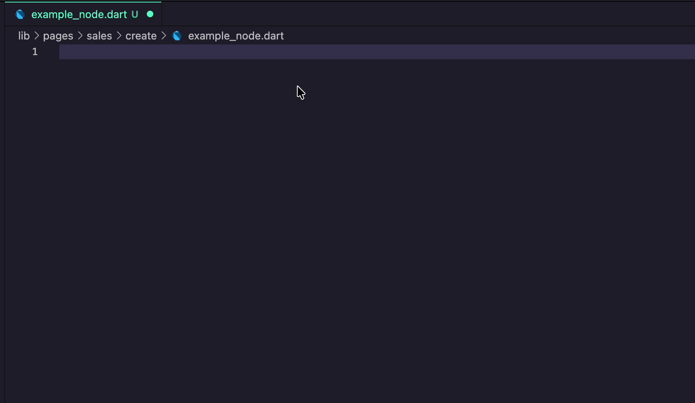

# Trinity Snippets

Snippets and code actions for Trinity state management in Flutter.

## Snippets

Type `nodeInterface` and press Tab:

Then you can type `signal` and press tab to create a signal.

## Wrap With

Place your cursor on any widget and press `Ctrl/Cmd + .`:

## Available Snippets

| Prefix | Description |
|--------|-------------|
| `signalBuilder` | Creates a SignalBuilder widget |
| `signalBuilderL` | Creates a SignalBuilder.listener widget |
| `signalBuilderMany` | Creates a SignalBuilder widget for multiple signals |
| `signalListener` | Creates a SignalListener widget |
| `signal` | Creates a new Signal instance |
| `futureSignal` | Creates a new FutureSignal instance |
| `streamSignal` | Creates a new StreamSignal instance |
| `computedSignal` | Creates a new ComputedSignal instance |
| `computedSignalMany` | Creates a new ComputedSignalMany instance |
| `nodeProvider` | Creates a NodeProvider |
| `nodeProviderB` | Creates a NodeProvider with builder |
| `nodeInterface` | Creates a NodeInterface class |
| `imtrinity` | Imports the Trinity package |
| `findNode` | Finds a node in the context |

## Available Wrap With

| Action | Description |
|--------|-------------|
| `Wrap with SignalBuilder` | Wraps the selected widget with a SignalBuilder |
| `Wrap with NodeProvider` | Wraps the selected widget with a NodeProvider |
| `Wrap with SignalListener` | Wraps the selected widget with a SignalListener |
